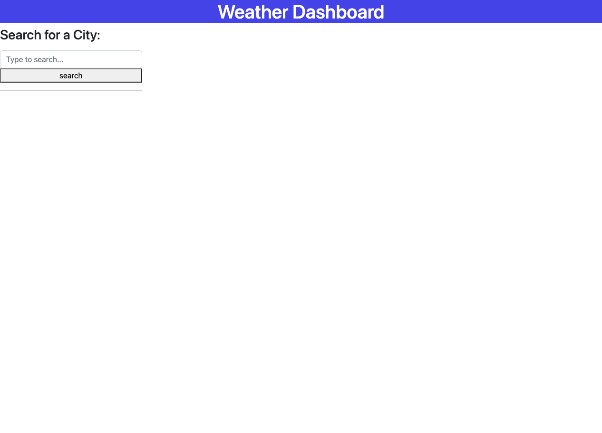
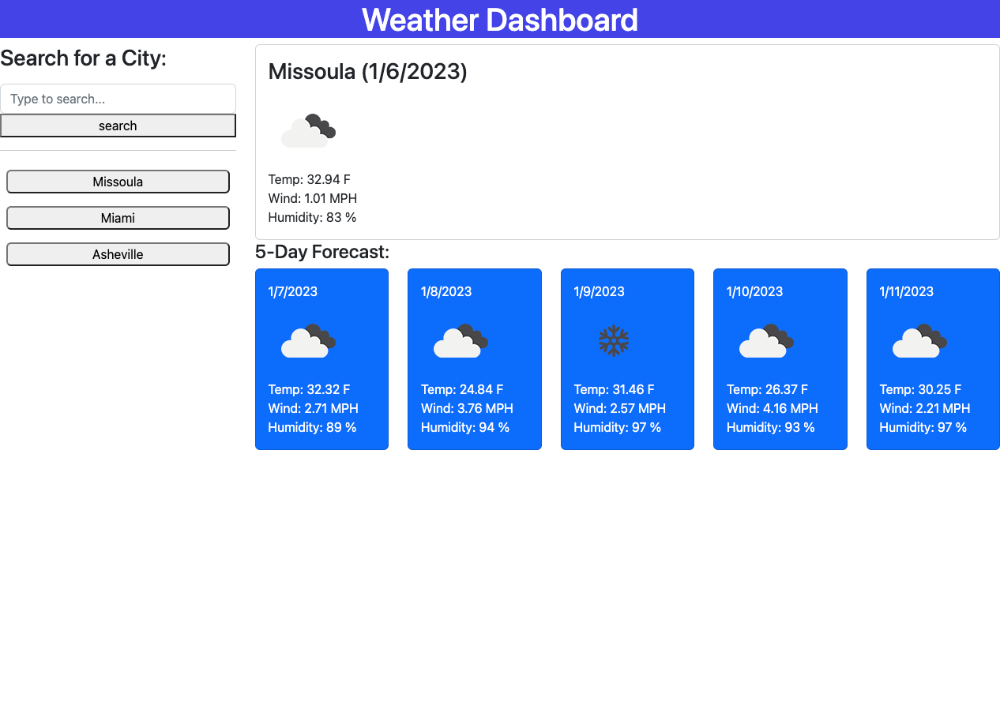

# [Weather-Dashboard](https://saidou25.github.io/Weather-Dashboard/)

[Link to this project's repository](https://github.com/Saidou25/Weather-Dashboard)

## Table of Contents
- [Description](#description)
- [Resources](#resources)
- [Visuals](#visuals)

## Description

The weather-Dashboard is an application which delivers current and forecast weather outlook for multiple cities. when rendered, the weather for that specific city is automatically saved on the screen for later access.

## Resources
This project was created using [Openweathermap](https://openweathermap.org/api).

## Visuals

This is a screenshot of what is presented to the user when the web page opens:

A view of the in use app:

