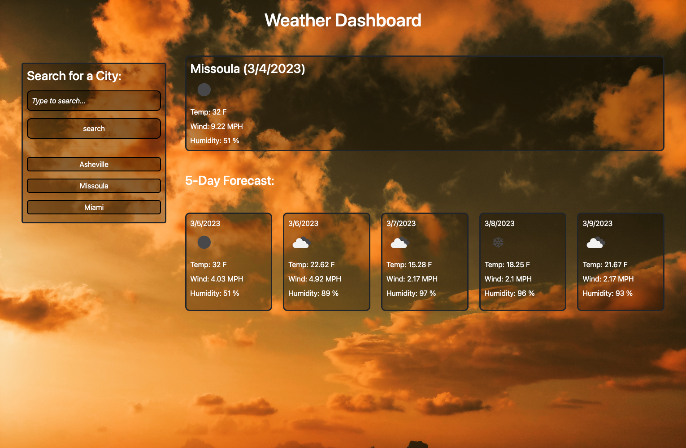

# [Weather-Dashboard](https://saidou25.github.io/Weather-Dashboard/)


[Link to this project's repository](https://github.com/Saidou25/Weather-Dashboard)

## Table of Contents
- [Description](#description)
- [Resources](#resources)
- [Visuals](#visuals)
- [User Story](#user-story)
- [Acceptance Criteria](#acceptance-criteria)

## Description

The weather-Dashboard is an application which delivers current and five-dayforecast weather outlook for multiple cities. when rendered, the weather for that specific city is automatically saved on the screen.

## User Story

`AS A traveler I WANT to see the weather outlook for multiple cities SO THAT I can plan a trip accordingly`


## Acceptance Criteria

```GIVEN a weather dashboard with form inputs
WHEN I search for a city
THEN I am presented with current and future conditions for that city and that city is added to the search history
WHEN I view current weather conditions for that city
THEN I am presented with the city name, the date, an icon representation of weather conditions, the temperature, the humidity, and the wind speed
WHEN I view future weather conditions for that city
THEN I am presented with a 5-day forecast that displays the date, an icon representation of weather conditions, the temperature, the wind speed, and the humidity
WHEN I click on a city in the search history
THEN I am again presented with current and future conditions for that city```

## Resources

This project was created using [Openweathermap](https://openweathermap.org/api).


## Visuals


A view of the in use app:




